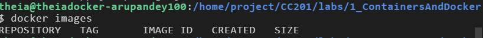

# containers-101
Introduction to containers with Docker, Kubernetes and OpenShift basics


Lab 1:
Introduction to Containers, Docker and IBM Cloud Container Registry
==================================================

Objectives
----------

In this lab, you will:

-   how to pull an Images/image from Docker Hub
-   run an Images/image as a container using docker
-   build an Images/image using a Dockerfile
-   push an Images/image to IBM Cloud Container Registry


About IBM Cloud
---------------

The IBM Cloud platform is deployed across data centers around the world. It combines platform as a service (PaaS) with infrastructure as a service (IaaS) to provide an integrated experience. The platform scales and supports both large enterprise businesses and small development teams and organizations.

The platform is built to support your needs, whether it's working only in the public cloud or taking advantage of a multicloud deployment model. IBM Cloud offers a variety of services, including Compute, Network, Storage, Management, Security, Databases, Analytics, AI, and Cloud Paks.

About IBM Cloud Container Registry namespaces
---------------------------------------------

IBM Cloud Container Registry is a multi-tenant registry in the public cloud. Namespaces are used to provide isolation for users' Images/images. The namespace is a slice of the registry to which you can push your Images/images. The namespace will be a part of the Images/image name when you tag and push an Images/image. For example, `us.icr.io/<my_namespace>/<my_repo>:<my_tag>`.

Create an IBM Cloud account
===========================

1.  Go to [IBM Cloud sign-up page](https://cloud.ibm.com/registration?cm_mmc=Inpersondirected-_-Audience+Developer_Developer+Conversation-_-WW_WW-_-Sep2020-understandingcontainerswithkubernetesoncloud-workshopseries-eventid-5f60da0db65b87024455335b-global-devadvgrp-bangalore-franchise-workshop-bangalore_ov75915&cm_mmca1=000039JL&cm_mmca2=10010797&eventid=5f60da0db65b87024455335b).

2.  Follow the steps to create your account. You will need to provide an email address and password, as well as some personal information. You'll have to verify your account by accessing your email.\
    

3.  Once you have created an account, go to the [IBM Cloud login page](https://cloud.ibm.com/registration?cm_mmc=Inpersondirected-_-Audience+Developer_Developer+Conversation-_-WW_WW-_-Sep2020-understandingcontainerswithkubernetesoncloud-workshopseries-eventid-5f60da0db65b87024455335b-global-devadvgrp-bangalore-franchise-workshop-bangalore_ov75915&cm_mmca1=000039JL&cm_mmca2=10010797&eventid=5f60da0db65b87024455335b) and log in to your account.\
    

Congratulations! You can now explore the [IBM Cloud catalog](https://cloud.ibm.com/kubernetes/catalog/) and provision various services.

Create a Container Registry namespace
=====================================

1.  Click the **Catalog** button in the top navigation to go to the [IBM Cloud catalog](https://cloud.ibm.com/registration?cm_mmc=Inpersondirected-_-Audience+Developer_Developer+Conversation-_-WW_WW-_-Sep2020-understandingcontainerswithkubernetesoncloud-workshopseries-eventid-5f60da0db65b87024455335b-global-devadvgrp-bangalore-franchise-workshop-bangalore_ov75915&cm_mmca1=000039JL&cm_mmca2=10010797&eventid=5f60da0db65b87024455335b).

2.  In the **Search the catalog...** box, type `Container Registry` and press Enter on your keyboard.

3.  Click the **Container Registry** tile in the search results.\
    

4.  You can now read about the Container Registry service and visit links for API documentation and docs about how to use the service.\

Verify the environment and command line tools
=====================================

1. Open a terminal window by using the menu in the editor: ```Terminal > New Terminal```.


2. Verify that ```docker CLI``` is installed.
   
3. Change to your project folder.
4. Clone the git repository that contains the artifacts needed.
   `[ ! -d 'CC201' ] && git clone https://github.com/ibm-developer-skills-network/CC201.git`
   

5. Change to the directory for this lab by running the following command. cd will change the working/current directory to the directory with the name specified, in this case CC201/labs/1_ContainersAndDcoker.
   `cd CC201/labs/1_ContainersAndDocker/`
6. List the contents of this directory to see the artifacts for this lab.
`ls`


Pull an Images/image from Docker Hub and run it as a container
=====================================

1. Use the docker CLI to list your Images/images.
You should see an empty table (with only headings) since you don’t have any Images/images yet.
   `docker Images/images`
   

2. Pull your first Images/image from Docker Hub.
   `docker pull hello-world`
   

3. List Images/images again
   `docker Images/images`
   
4. Run the hello-world Images/image as a container.
   `docker run hello-world`
   
   To generate this message, Docker took the following steps:
   * The Docker client contacted the Docker daemon.
   * The Docker daemon pulled the "hello-world" Images/image from the Docker Hub.
    
   * The Docker daemon created a new container from that Images/image which runs the executable that produces the output you are currently reading.
   * The Docker daemon streamed that output to the Docker client, which sent it to your terminal.
5. List the containers to see that your container ran and exited successfully.
`docker ps -a`

6. Note the CONTAINER ID from the previous output and replace the <container_id> tag in the command below with this value. This command removes your container.
   `docker container rm <container_id>`
   
7. Verify that that the container has been removed. Run the following command.
   `docker ps -a`
   


Build an Images/image using a Dockerfile
=====================================

1. The current working directory contains a simple Node.js application that we will run in a container. The app will print a hello message along with the hostname. The following files are needed to run the app in a container:
   * app.js is the main application, which simply replies with a hello world message.
   * package.json defines the dependencies of the application.
   * Dockerfile defines the instructions Docker uses to build the Images/image.
2. Run the following command to build the Images/image:
   `docker build . -t myImages/image:v1`
   
    the output creates a new layer for each instruction in the Dockerfile.
3. List Images/images to see your Images/image tagged myImages/image:v1 in the table.
   `docker Images/images`
   

Run the Images/image as a container
=====================================

1. Now that your Images/image is built, run it as a container with the following command:
   `docker run -dp 8080:8080 myImages/image:v1`
   
   The output is a unique code allocated by docker for the application you are running.

2. Run the curl command to ping the application as given below.
`curl localhost:8080`


3. Now to stop the container we use docker stop followed by the container id. The following command uses docker ps -q to pass in the list of all running containers:
   `docker stop $(docker ps -q)`
   

4. Check if the container has stopped by running the following command.
   `docker ps`
   

Push the Images/image to IBM Cloud Container Registry
=====================================
1. The environment should have already logged you into the IBM Cloud account that has been automatically generated for you by the Skills Network Labs environment. The following command will give you information about the account you’re targeting:
   `ibmcloud target`
   
2. The environment also created an IBM Cloud Container Registry (ICR) namespace for you. Since Container Registry is multi-tenant, namespaces are used to divide the registry among several users. Use the following command to see the namespaces you have access to:
   `ibmcloud cr namespaces`
   

3. nsure that you are targeting the region appropriate to your cloud account, for instance us-south region where these namespaces reside as you saw in the output of the ibmcloud target command.
   `ibmcloud cr region-set us-south`
   

4. Log your local Docker daemon into IBM Cloud Container Registry so that you can push to and pull from the registry.
   `ibmcloud cr login`
   

5. Export your namespace as an environment variable so that it can be used in subsequent commands.
   `export MY_NAMESPACE=sn-labs-$USERNAME`
   

6. Tag your Images/image so that it can be pushed to IBM Cloud Container Registry.
   `docker tag myImages/image:v1 us.icr.io/$MY_NAMESPACE/hello-world:1`
   

7. Push the newly tagged Images/image to IBM Cloud Container Registry.
   `docker push us.icr.io/$MY_NAMESPACE/hello-world:1`
   

8. Verify that the Images/image was successfully pushed by listing Images/images in Container Registry.
   `ibmcloud cr Images/images`
   